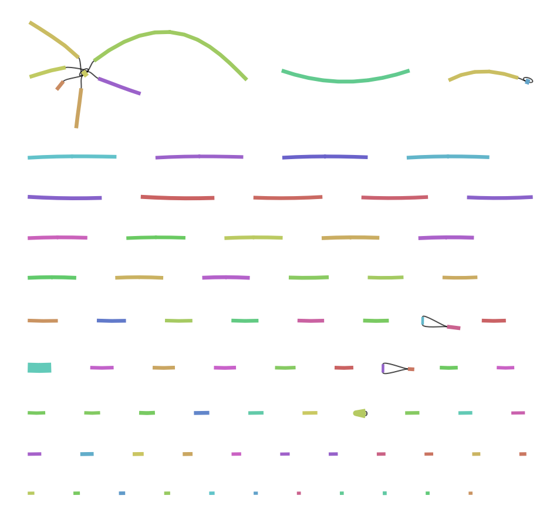
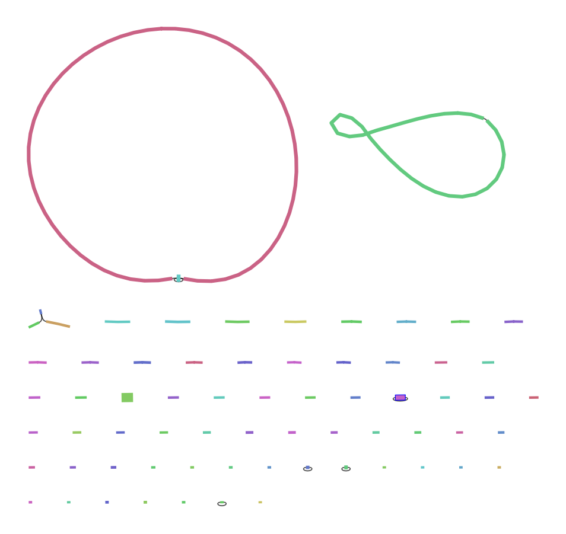
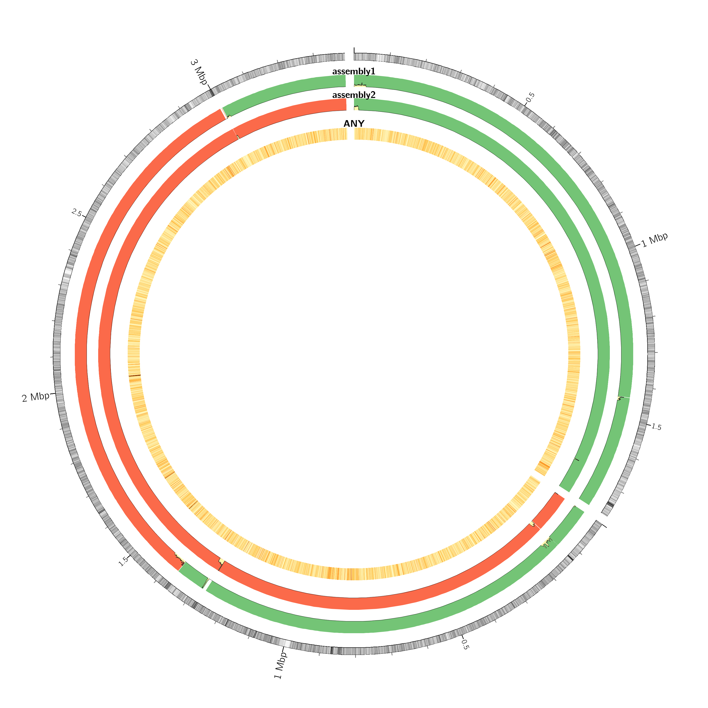

```{r setup, include=FALSE}
knitr::opts_chunk$set(echo = TRUE)
```

::: {.callout-note icon="FALSE"}
In this document, all yellow code chunks indicate bash (R Terminal) code input. Comments begin with `#`; these are listed for reference only, and should not be entered into the Terminal.

All other code chunks indicate R code, which should be input into the Console.
:::

## Redbean Assembly

In this step we will assemble a genome with **redbean**, one of the fastest long read genome assemblers. (Software is available at GitHub [here](https://github.com/ruanjue/wtdbg2).)

```{bash setup redbean, eval=FALSE}
#| code-fold: false

mkdir workshop2
cd workshop2

# Prepare a directory for running the software
mkdir redbean
cd redbean

# Collect a small subset of data for initial assembly
cat /pvol/data/amtp4/*_[012].fastq > amtp4.fastq
# We will use just the first 3 files: 12000 reads, ~6x coverage of the target genome (not nearly enough to generate a good assembly!)

# Run the assembly
wtdbg2 -x ont -g 5m -t 4 -i amtp4.fastq -fo amtp4 
wtpoa-cns -t 4 -i amtp4.ctg.lay.gz -fo amtp4.ctg.fa

# How long did this take? Inspect assembly statistics by running this:
assembly-stats amtp4.ctg.fa
```

### Assembly Stats

In our assembly stats, N50 has the highest value, which tells us that a larger portion of the genome is assembled into long, contiguous pieces. This is representative of a good genome assembly!

-   sum = assembly length
-   n = \# of contigs
-   ave = average contig length
-   largest = largest contig length

| sum = 3639649, n = 120, ave = 30330.35, largest = 143809
| N50 = 48273, n = 23
| N60 = 36829, n = 32
| N70 = 28879, n = 43
| N80 = 22438, n = 57
| N90 = 13359, n = 79
| N100 = 2697, n = 120
| N_count = 0
| Gaps = 0

### Run `redbean` again with higher coverage

Now we will use data that is similar to 20x coverage (much better than 6x!).

```{bash run redbean, eval=FALSE}
cat /pvol/data/amtp4/*.fastq > amtp4_20x.fastq
wtdbg2 -x ont -g 5m -t 4 -i amtp4_20x.fastq -fo amtp4_20x
wtpoa-cns -t 4 -i amtp4_20x.ctg.lay.gz -fo amtp4_20x.ctg.fa

# Inspect assembly statistics
assembly-stats amtp4_20x.ctg.fa
```

| stats for amtp4_20x.ctg.fa
| sum = 6878946, n = 89, ave = 77291.53, largest = 3344232
| N50 = 1764944, n = 2
| N60 = 1764944, n = 2
| N70 = 1764944, n = 2
| N80 = 54425, n = 8
| N90 = 23747, n = 28
| N100 = 4477, n = 89
| N_count = 0
| Gaps = 0

We have fewer contigs, and the average contig length is much greater.

## Flye Assembly

**Flye** is an alternative genome assembler (can be installed from GitHub [here](https://github.com/mikolmogorov/Flye)). It is fast, but not as fast as redbean.

```{bash setup flye, eval=FALSE}
pwd

# Move up a directory
cd ..

# Need to set up a working directory where we will store outputs and run commands.
mkdir flye
cd flye
```

We need to make symbolic links to the data we used for `redbean`:

```{bash link to redbean data, eval=FALSE}
ln -s ../redbean/amtp4.fastq .
ln -s ../redbean/amtp4_20x.fastq .
```

We will run flye using the queuing system `slurm`. Instead of just typing the command in the Terminal we need to wrap our command into a short “job script”, a separate file where we will include instructions about how much memory and CPUs we need as well as the command to run.

I've created a new shell script file (File \> New File \> Shell Script) called `run_flye_small.sh` (code below), and saved it in my flye directory.

```{bash small shell script, eval=FALSE, include=FALSE}
#!/bin/bash
#SBATCH --time=60
#SBATCH --ntasks=4 --mem=4gb

echo "Starting flye in $(pwd) at $(date)"

flye --nano-raw amtp4.fastq --out-dir amtp4 --genome-size 5m --threads 4

echo "Finished flye in $(pwd) at $(date)"
```

Submit the the slurm script to the queue using the `sbatch` command:

```{bash run flye small, eval=FALSE}
sbatch run_flye_small.sh
# IMPORTANT: only run this command once so you don't end up with multiple conflicting runs of flye trying to overwrite one another

# Check job status
squeue
```

New file in my flye directory: `slurm-653.out`.

```{bash investigate slurm file, eval=FALSE}
# Investigate the file
tail slurm-653.out

# To follow the flye command as it's running:
tail -f slurm-653.out
```

| Total length: 5191996
| Fragments: 77
| Fragments N50: 119681
| Largest frg: 374326
| Scaffolds: 0
| Mean coverage: 7

Once flye has finished, the final assembly will be available inside the output directory (`amtp4`) and will be called `assembly.fasta`. Use the `assembly-stats` program to assess the contiguity and completeness of this assembly.

Now we will make a new shell script file, `run_flye_large.sh` (code below), in our `flye` directory and run it on the `amtp4_20x.fastq` file.

```{bash run_flye_large, eval=FALSE}
#!/bin/bash
#SBATCH --time=360
#SBATCH --ntasks=4 --mem=4gb

echo "Starting flye in $(pwd) at $(date)"

flye --nano-raw amtp4_20x.fastq --out-dir amtp4_20x --genome-size 5m --threads 4

echo "Finished flye in $(pwd) at $(date)"
```

```{bash large shell script, eval=FALSE}
sbatch run_flye_large.sh
```

New file in `flye` directory: `slurm-654.out`.

### Investigate flye output

```{bash flye output stats, eval=FALSE}
assembly-stats amtp4/assembly.fasta
```

| stats for amtp4/assembly.fasta
| sum = 5191996, n = 77, ave = 67428.52, largest = 374326
| N50 = 119681, n = 16
| N60 = 99731, n = 20
| N70 = 73460, n = 26
| N80 = 48300, n = 35
| N90 = 31578, n = 48
| N100 = 2777, n = 77
| N_count = 0
| Gaps = 0

## Inspect assembly graphs with Bandage

### Inspect low coverage flye assembly

Export the file `assembly-graph.gfa` from the `amtp4/flye` file directory.

Download and install [Bandage](https://rrwick.github.io/Bandage/). Open Bandage and use the `File -> Load Graph` menu to load the file `assembly-graph.gfa`. Click `Draw Graph`.

```{r low-cov_fig, echo=FALSE, out.width="90%"}

```

In this visualisation contiguous segments are shown as solid coloured lines. Some of these are separated into independent graphs whereas others (e.g. the mess in the top left corner) are connected to each other via black lines. Some things to keep in mind:

1.  Biologically distinct entities, such as chromosomes or plasmids, will form separate graphs.
2.  Separated graphs can also occur if coverage is very low and no reads exist to join parts of the assembly together.
3.  Highly joined regions tend to occur because repeats create ambiguities. There are too many connections and the assembler has trouble choosing the correct path between them.

**Observations from the graph:**

-   There don't appear to be any chromosomes in this graph - depth is too low (1-7x).
-   Amongst the contigs that are joined together, the small yellow one in the middle is likely a repeat as it has a depth of **38x** but is only 5,213 bp (base pairs) long.
-   There appears to be another potential repeat in the graph: the thick turquoise contig on the left end of the 4th row from the bottom. It has a depth of **122x** but is only 48,300 bp long!

### Inspect high coverage flye assembly

Repeat this process with the "assembly-graph.gfa" file from the `amtp4_20x/flye` file directory.

```{r high-cov_fig, echo=FALSE, out.width="90%"}

```

**Observations from the graph:**

-   There are 2 nodes that connect to themselves at the top of the graph. The largest one is 3,367,285 bp and has a depth of 24x. The smaller one is 1,775,265 bp and has a depth of 23x.
-   There is a small node (5,655 bp) connected to itself and the largest node - it has a depth of 207x! I wonder if this is a plasmid with a lot of repeats.
-   In the top left corner there are 3 nodes connected to one another. Based on their small depth (3-5x) I don't think they are chromosomes.
-   The short, thick node in the fourth row from the bottom has a depth of 370x but only 47,228 bp. In the same row the pink node connected to itself has a depth of 83x and only 40,865 bp.
-   There are lots of plasmids in the graph.

## Check Assembly Quality with QUAST

While we could clearly see a huge improvement above in contiguity with the addition of more reads, we could not easily check for the accuracy of assemblies.

Here we have a reference assembly which was previously created using very deep coverage and best-practice genome polishing tools. By comparing our assemblies to the reference we can assess them in terms of all the important metrics, contiguity, completeness and correctness.

### Setup a Quast working directory

```{bash create quast dir, eval=FALSE}
# Move to the directory above flye
pwd
cd ..

# Make a new directory
mkdir quast
cd quast
```

### Prepare assembly data

Make two directories within the quast directory.

```{bash make flye redbean directories, eval=FALSE}
mkdir flye_asm redbean_asm
```

Our reference assembly only contains contigs for the two major Vibrio chromosomes. For our two deeper coverage assemblies this will correspond to the two largest contigs. We extract these (and ignore all others) in order to make the assembly comparison easier to interpret.

```{bash investigate flye assemblies, eval=FALSE}
# Look at contig sizes in the flye assembly:
cat ../flye/amtp4_20x/assembly.fasta | bioawk -c fastx '{print $name, length($seq)}' | sort -n -k2

# Use samtools to extract 2 largest contigs:
samtools faidx ../flye/amtp4_20x/assembly.fasta contig_15 contig_3 > flye_asm/vibrio.fasta
```

Repeat for the redbean assembly.

```{bash investigate redbean assemblies, eval=FALSE}
cat ../redbean/amtp4_20x.ctg.fa | bioawk -c fastx '{print $name, length($seq)}' | sort -n -k2
samtools faidx ../redbean/amtp4_20x.ctg.fa ctg1 ctg2 > redbean_asm/vibrio.fasta
```

```{bash symbolic link, eval=FALSE}
# Create a symbolic link to the original reads
ln ../flye/amtp4_20x.fastq .

# Create a symbolic link to the reference assembly
ln -s /pvol/data/amtp4/reference/vibrio .
```

### Run QUAST

```{bash quast, eval=FALSE}
quast -o quast_vibrio redbean_asm/vibrio.fasta flye_asm/vibrio.fasta -L -t 4 --circos --glimmer -r vibrio/vibrio.fna --features  vibrio/vibrio.gff --nanopore amtp4_20x.fastq
```

This output is saved to the folder `quast_vibrio`. Look at the main report (`report.html`) and the circos plot (`circos/circos.png`).

```{r circos, echo=FALSE, out.width="90%"}

```

Both assemblers seem to have done a very good job of assembling the genome but both have produced regions where there are a large number of small differences (snps and indels) between the assembly and the reference. The redbean assembly also seems to have a couple of gaps which most likely correspond with the highly repetitive region we observed in the Bandage visualisation.

## Mystery Repeat Region

The 'flye' assembly contains a repeat region that could not be completely resolved.

```{bash make repeat dir, eval=FALSE}
# Create a new directory to store results in
mkdir ../repeat
cd ../repeat
```

### Extract repeat region sequence

In Bandage, with the assembly graph from amtp4_20x:

-   Click on the repeat contig
-   `Output -> Copy selected node sequences to clipboard`
-   In RStudio, open a blank text file and paste the sequence
-   Edit the text file to add header `>repeat_1`
-   Save file into `repeat/repeat.fasta`

```{bash prokka, eval=FALSE}
# Use prokka to annotate this sequence to see if it contains any transcribed sequences
prokka --outdir prokka --prefix repeat repeat.fasta

# What type of genomic features does this produce?
cat prokka/repeat.tsv
```

## Genomic arrangement of repeats

We don't know how the repeats are arranged in the genome. We are specifically interested in whether they are arranged in tandem or dispersed throughout the genome. We can map the repeat sequence back to the genome itself using [minimap2](https://github.com/lh3/minimap2).

```{bash arrangement of repeats, eval=FALSE}
# Link in the data
ln -s ../quast/vibrio/vibrio.fna .

# Run minimap2
minimap2 -x map-ont vibrio.fna repeat.fasta > repeat_vs_genome.paf

# Examine the alignment
head repeat_vs_genome.paf
```

Formatting is explained on [this webpage](https://github.com/lh3/miniasm/blob/master/PAF.md)

```{bash repeats, eval=FALSE}
cat repeat_vs_genome.paf | grep '^repe' | awk -F '\t' '{print $6,$8,$9}' > repeat_locations.bed

# column 2 = target sequence length
# column 3 = target start on original strand (0-based)
```
