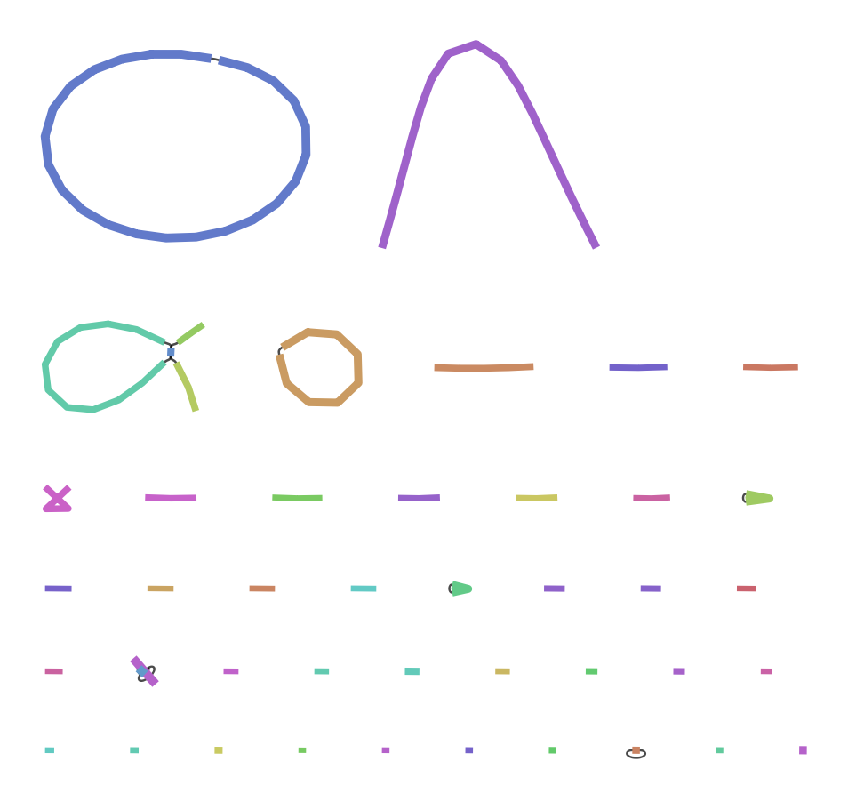
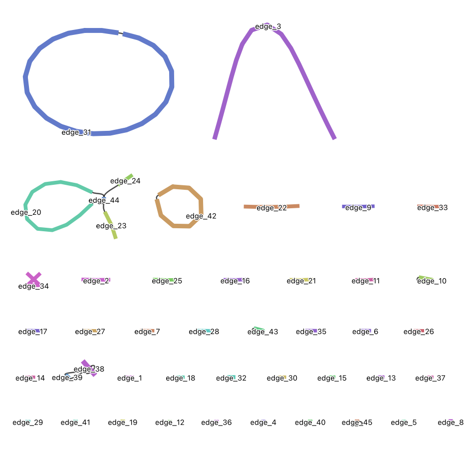

```{r setup, include=FALSE}
knitr::opts_chunk$set(echo = TRUE)
```

------------------------------------------------------------------------

***In this workshop, most code is UNIX code, but some is R code.***

------------------------------------------------------------------------

In this workshop we will assemble a mock metagenome consisting of five bacterial species. This is very simple compared with a real metagenome, but has been designed to capture some key challenges that appear in metagenome assembly:

-   **Variable coverage**: Some species are abundant, some are quite rare. It is more difficult to assemble rarer taxa.
-   **Similar sequences**: This community has two *Vibrio* species. They are similar enough that they are difficult to separate in an assembly.

The table below shows the relative abundance (`Proportion of Reads`) of each species in our mock community. Since this is a mock community we already have reference genomes for each member. Information on each genome can be found by typing its accession (eg. ASM31704v1) into the search field on the [NCBI database of microbial genomes](https://www.ncbi.nlm.nih.gov/datasets/genome/?taxon=2157,2).

For the purposes of metagenomic assembly we note the number of chromosomes, total genome size and its GC content. We will use these pieces of information later to assess our preliminary assembly results.

| Proportion of Reads | Species | Accession | Number of chromosomes | Size | GC Content |
|------------|------------|------------|------------|------------|------------|
| 44.5 | Geitlerinema sp. PCC 7407 | ASM31704v1 | 1 | 4.7Mb | 58 |
| 30 | Vibrio alfacsensis | ASM1967048v1 | 2 | 5.3Mb | 44 |
| 7.5 | Vibrio algicola | ASM960176v2 | 3 | 3.5Mb | 42 |
| 15 | Desulfovibrio sulfodismutans | ASM1337645v1 | 2 | 4.4Mb | 63.5 |
| 3 | Winogradskyella schleiferi | ASM1339465v1 | 1 | 4.6Mb | 34.5 |

## Workshop outline

1.  Examine reads
2.  Assembly
3.  Basic assembly QC
4.  Binning
5.  Bin assessment

## Step 1: Examine Reads

Input data for this exercise consists of simulated reads from an Oxford Nanopore MinION sequencer.

```{bash raw_reads directory, eval=FALSE}
# Make a new subdirectory, raw_reads
mkdir raw_data
cd raw_data
ln -s /pvol/data/metagenome_assembly/reads_R10_0.5.fastq.gz raw_reads.fastq.gz

# Change directory back "up"
cd ..
```

```{bash}
ls -lR
```

### Read Length Distribution

During the assembly process we will take shorter sequences (reads) and attempt to join them together into longer sequences. One of the most important determinants of success in this process is the size of the raw reads themselves. Our starting point for this assembly is to examine the read length distribution in our input data.

```{bash, eval=FALSE}
zcat raw_data/raw_reads.fastq.gz | head -n 40000 | bioawk -c fastx '{print $name,length($seq)}' > read_lengths.txt
```

Now we'll create a plot to visualize these lengths.

```{r}
library(tidyverse)

rl_data <- read_tsv("../read_lengths.txt", col_names = c("id", "length"), show_col_types = FALSE)

ggplot(rl_data, aes(x = length/1000)) +
  geom_histogram(binwidth = 2) +
  xlab("Read Length Kb") +
  ylab("Number of Reads")
```

### Calculating read N50

From this plot it is clear that the majority of reads are between 1 and 50kb in length. A good way to summarise this is the N50 statistic. Although N50 is most often used to summarise genome assemblies it’s also very useful for summarising read length distributions. The reason this statistic is useful is because it is unaffected by having a large number of tiny reads and instead places greatest emphasis on the longer reads in the data. Let’s calculate the read N50 for our sample of reads.

-   Step 1: Rank all reads from longest to shortest
-   Step 2: Create a new column with the cumulative sum of read lengths (starting from longest read).
-   Step 3: Find the read at which the cumulative sum surpasses 50% of the total read volume (ie total sum of all read lengths)

```{r}
total_len <- sum(rl_data$length)

rl_data %>% 
  # Arrange reads by length in descending order
  arrange(desc(length)) %>% 
  # Calculate cumulative sum for each successive read
  mutate(cumsum = cumsum(length)) %>% 
  filter(cumsum>total_len/2) %>% 
  head(n=1)
```

The N50 of the individual reads is \~ 22Kb. Keep this in mind as we assemble the reads. We expect that the N50 of our assembly should be much greater than this.

## Step 2: Assembly

We will use `flye` for this.

```{bash make flye directory, eval=FALSE}
mkdir flye
cd flye
```

Create a new shell script, `run_flye.sh`, in the `flye` directory.

```{bash run_flye.sh script, eval=FALSE}
#!/bin/bash
#SBATCH --time=360
#SBATCH --ntasks=8 --mem=4gb
   
echo "Starting flye in $(pwd) at $(date)"
   
flye --nano-hq ../raw_data/raw_reads.fastq.gz --threads 8 --out-dir mock --meta
   
echo "Finished flye in $(pwd) at $(date)"
```

```{bash submit job, eval=FALSE}
# Submit job
sbatch run_flye.sh

squeue  # check JOBID for next command

# Monitor job output
tail -f slurm-XXX.out   # replace XXX with JOBID
```

Outputs will be available in directory `mock`. Key output files are:

| **File**           | **Description**                                     |
|--------------------|-----------------------------------------------------|
| assembly.fasta     | The actual assembled contigs                        |
| assembly_graph.gfa | Representation of the assembly graph in gfa format. |
| assembly_graph.gv  | Assembly graph in graphviz format                   |
| assembly_info.txt  | Table of information on each contig                 |

(*Export "assembly.fasta" file and open in Bandage to view contigs.*)





**Observations**:

-   Largest contig (edge_31) = 4,681,059 bp; depth 21x. I'm guessing that this contig corresponds to the genome of the most abundant species in our mock community.
-   Contig 42 could also be a genome from our mock community (1,551,213 bp; depth 15x).
-   Contig 31 and 42 are chromosomes - we know this because they are circular (i.e. connected to themselves).
-   Contig 38 must be a repeat - it has a length of only 516 bp but a depth of 789x!
- Contig 34 is interesting: 574,744 bp with a depth of 7x.

### Chromosome lengths and GC content in the reference data

We want to compare the assembled contigs (from the flye output) with reference genomes from the 5 species that compromise our mock community. We will do this by tabulating chromosome lengths and their corresponding GC content.

Make a new text file called "gc.awk" with the code in the chunk directly below. Save the file in the top level of the project directory.

```{bash code for "gc.awk" text file, eval=FALSE}
# Bioawk script for calculating gc and printing name,length,size
BEGIN {
	OFS="\t"
}

{
	l=length($seq)
	ngc=gsub("[cgCG]","",$seq)
	nat=gsub("[taTA]","",$seq)
	print $name,l,ngc/(ngc+nat)
}
```

```{bash, eval=FALSE}
# Look at reference genomes from our mock community
ls /pvol/data/mg/refs/*.fna
```

Use the `gc.awk` file we made to print the GC content and contig lengths for all chromosomes in these files. Use 'cat' to concatenate all the files together and then use a pipe to send their contents to our bioawk program.

```{bash, eval=FALSE}
cd ..
cat /pvol/data/mg/refs/*.fna | bioawk -c fastx -f gc.awk
```

| CP003591.1      4681111   0.584631
| CP045504.1      4388462   0.636383
| CP045505.1      51725     0.578966
| AP024165.1      3168162   0.44373
| AP024166.1      1553697   0.438144
| AP024167.1      320083    0.418301
| AP024168.1      221076    0.434733
| CP098033.1      1819821   0.445875
| CP098034.1      3294375   0.447314
| CP098035.1      36224     0.485231
| NZ_CP053351.1   4560973   0.34633

In the assembly graph shown above, the two circular chromosomes are for *Vibrio alfacsensis*.

## Step 3: Basic Assembly QC

Here we will print the length and GC content for our assembled contigs.

```{bash, eval=FALSE}
mkdir assembly_check
cd assembly_check

# Use gc.awk script to print GC and lengths for assembly
cat ../flye/mock/assembly.fasta | bioawk -c fastx -f ../gc.awk 

# Now, send outputs to a file "assembly.gc.tsv"
cat ../flye/mock/assembly.fasta | bioawk -c fastx -f ../gc.awk > assembly.gc.tsv
```

Now we'll create some plots in R to explore the GC content and coverage depth of contigs. In a real metagenomic assembly we would not know the reference sequences and we want to be able to group contigs from the same species together. Two important statistics for this are GC content and coverage depth because these should generally be similar for contigs derived from the same chromosome.

We have GC content in `assembly.gc.tsv` and coverage depth in the `assembly_info.txt` file produced by `flye.` Let’s read those and join them together using R.

```{r}
library(tidyverse)

gc <- read_tsv("../assembly_check/assembly.gc.tsv",col_names = c("#seq_name","length","GC"))
info <- read_tsv("../flye/mock/assembly_info.txt")
```

```{r}
# join datasets as they both have a '#seq_name' column
gc_info <- info %>%
  left_join(gc)

gc_info %>% 
  ggplot(aes(x=GC)) + 
  geom_histogram() + 
  ylab("Number of contigs")
```

A GC vs coverage plot helps identify clusters with similar values for both parameters.

```{r}
gc_info %>%
  # Filter data to remove contigs with unrealistically high GC content
  filter(GC < 0.8) %>%
  # Filter data to remove contigs with very high coverage depth (likely repeats)
  filter(cov.<25) %>%
  ggplot(aes(x = GC, y = cov.)) +
  geom_point(aes(size = length)) +
  ylab("Coverage depth") +
  labs(caption = "Only contigs with > 25x coverage and < 80% GC coverage are shown.")
```

```{r}
library(ggrepel)

gc_info %>% 
  filter(GC<0.8) %>% 
  filter(cov.<25) %>% 
  ggplot(aes(x=GC,y=cov.)) + geom_point(aes(size=length)) + geom_label_repel(aes(label=`#seq_name`)) +
  labs(caption = "Only contigs with > 25x coverage and < 80% GC coverage are shown.")
```

### Assembly size vs reference size

Since our mock metagenome has a precisely known composition we can assess its completeness in a crude way simply by comparing the length of our assembly with that of the reference.

```{bash, eval=FALSE}
cd ~/workshop3_metagenomes
```

Firstly lets calculate the total length of our reference sequences. This command builds on one we ran earlier to list the size and GC content of reference chromosomes, but this time we have added another very simple awk program to take the sum of the second column.

```{bash, eval=FALSE}
cat /pvol/data/mg/refs/*.fna | bioawk -c fastx -f gc.awk | awk '{sum+=$2}END{print sum}'
```

*Total length of reference is around 24Mb.*

In a real metagenomic assembly there is nothing to compare the total assembly length with so we don’t usually assess completeness this way. Later we will explore how to assess completeness for individual taxa within our assembly which is the common approach in real situations. For now, let’s continue to use the assembly length as a metric because this will allow us to explore the effect of sequencing volume on assembly completeness.

## Step 4: Binning

One of the most challenging tasks in metagenomic assembly is separating sequences from the many different organisms that were present in the sample. Broadly speaking tools fall into two categories:

1.  Read binning tools which group the raw (unassembled) reads
2.  Contig binning tools which group assembled contigs

In both cases the resulting outputs are “bins” each of which will contain multiple distinct sequences (reads or contigs) that come the same organism. It is important to acknowledge that binning is a very difficult problem and the results from binning tools often contain errors such as:

1.  Placing two sequences together when they come from different taxa (leads to **contamination**)
2.  Failing to group sequences that come from the same taxon (lead to **fragmentation**)

We will perform contig binning here since we have long-reads and can rely on metaFlye to do a good job of assembling high quality contigs from a mixed collection of reads.

Firstly we will use the program `metabat2.` This program tries to group contigs based on nucleotide composition and read coverage. This is very similar to what we did with our plotting approach in step 3 but uses more sophisticated clustering and looks at tetranucleotide frequency instead of just GC content.

For simplicity and speed we will use coverage information already calculated by `flye` and provide this to metabat.

```{bash metabat dir, eval=FALSE}
# Make a directory for our binning work
mkdir metabat
cd metabat
```

```{bash metabat, eval=FALSE}
# Prepare an input file summarising read depth information for all contigs
cat ../flye/mock/assembly_info.txt  | grep -v '#' | awk '{OFS="\t";print $1,$3}' > depths.txt

# Create a new version of the assembly file in which the contigs have the same order as those in the "depths.txt" file. We do this using a `samtools faidx` which allows us to extract entries from a fasta file in whatever order we specify.
cat depths.txt | awk '{print $1}' | xargs samtools faidx ../flye/mock/assembly.fasta > assembly_ordered.fasta

# Run metabat
metabat2 -i assembly_ordered.fasta -a depths.txt --cvExt -o bins/metabat --seed 5
```

The `bins` directory (in the metabat directory) will contain multi-fasta files with each of the bins inferred by metabat.

```{bash, eval=FALSE}
# quickly inspect which contigs were grouped into which bin
grep '>' bins/*
```

metabat has grouped contigs into 7 bins (exact numbers can vary from run to run which is why we used the `--seed` argument). If you compare the contigs in these bins with those shown in bandage you can see that *the largest and highest coverage contig (contig_31) has not been included*. Other than this some of the other bins seem to make some sense. For example you should see bins that contain similar groupings of contigs to those that you explored by hand using bandage + GC content and coverage.

## Step 5: Check bin quality with checkM

We will use a program called [checkM](https://github.com/Ecogenomics/CheckM). to assess the quality of our bins. Remember that each bin generated by metabat should represent a single species or strain within our community. Our goal is to create bins in which;

1.  The sequences within the bin contain the **complete** sequence for this organism.
2.  The sequences within the bin all come from the same organism and are **not contaminated** with sequences from other taxa.

We can assess the degree to which our binning and assembly has achieved these goals using checkM.

```{bash checkM directory, eval=FALSE}
cd ~/workshop3_metagenomes
mkdir checkm
cd checkm
```

```{bash}
# prepare inputs for checkM - copy over the bins from metabat
mkdir bins
cp ../metabat/bins/metabat.*.fa bins/
```

Remember that metabat failed to include our longest contig in bins (contig_31). We need to extract this contig from our assembly and include it with our metabat bins.

```{bash, eval=FALSE}
samtools faidx ../flye/mock/assembly.fasta contig_31 > bins/contig_31.fa
```

In `checkm` directory, save a new shell script for us to run ("run_checkm.sh"). We do this because `checkm` can be very resource intensive.

```{bash run_checkm.sh shell script, eval=FALSE}
#!/bin/bash
#SBATCH --time=60
#SBATCH --ntasks=4 --mem=40gb

echo "Starting checkm in $(pwd) at $(date)"

shopt -s expand_aliases
alias checkm='apptainer run -B /pvol/:/pvol /pvol/data/sif/checkm.sif checkm'

checkm lineage_wf bins out -t 4 -x fa -f checkm_results.txt

echo "Finished checkm in $(pwd) at $(date)"
```

```{bash, eval=FALSE}
# Submit job
sbatch run_checkm.sh
```

The results file, "checkm_results.txt", provides a summary of results for each of the bins. This includes:

-   *Marker Lineage*: An approximate taxonomic classification. This is used by checkM to determine which marker genes to use for completeness and contamination checks
-   *\# genomes*: number of reference genomes used to infer marker set
-   *\# markers*: number of inferred marker genes
-   *\# marker sets*: number of inferred co-located marker sets
-   *0-5+*: number of times each marker gene is identified
-   *Completeness*: estimated completeness. This is calculated by taking the number of marker genes appearing exactly 1 time and dividing by the total
-   *Contamination*: estimated contamination. This is the number of marker genes appearing \>1 times divided by the total
-   *Strain heterogeneity*: estimated strain heterogeneity. This is calculated by examining the marker genes appearing \>1 times and determining the proportion of these that are from the same or very similar organisms (strains).

**Observations**

-   The bin with the highest contamination level is *metabat.7*. 
